# 💻 Domain: Web Development 

# 👒 Team Straw Hats

# 💡 Project : Learn to Earn Web Platform

A decentralized learning platform where users **complete quizzes or tasks** and earn **Aptos tokens** as rewards. Designed to promote education through incentivization, all progress and rewards are securely recorded using **blockchain technology**.

> 🏆 This project is submitted as part of a **Hackathon**. GitHub repository contains full source code, smart contracts, and setup instructions.

---

## 📜 Abstract

The **Learn to Earn Web Platform** revolutionizes online education by integrating **blockchain** and **crypto rewards** to encourage active learning. Users participate in educational activities like quizzes and tasks, and upon completion, they earn **Aptos tokens**, which are stored and tracked on-chain. The platform is built on the **Aptos Blockchain**, known for its scalability, speed, and use of the secure **Move language**.

By leveraging the **Aptos SDK**, we seamlessly connect with the **Petra Wallet** for user login, secure wallet-based authentication, and reward transactions. Each completed task is logged on the blockchain to ensure transparency, immutability, and fairness. Smart contracts written in **Move** govern the reward logic and token transfers, ensuring a trustless reward mechanism without intermediaries.

To enhance reliability, **user profiles and authentication** are stored securely in a PostgreSQL database. The hybrid architecture ensures off-chain data like profiles and credentials remain private, while all reward-related data is stored immutably on-chain.

This project not only promotes decentralized education but also demonstrates the real-world utility of blockchain in incentivizing learning. With **Petra Wallet integration**, task-to-token flow, and tamper-proof reward distribution, our platform paves the way for a new era of transparent, blockchain-powered e-learning.

---

## 🧠 Project Explanation

### Why Blockchain?
- Prevents tampering with user progress or rewards.
- Transparent and immutable tracking of tasks and achievements.
- Direct, secure token distribution without intermediaries.

### Aptos Blockchain:
- Fast, scalable Layer 1 blockchain.
- Smart contracts written in **Move** language.
- Petra Wallet used for authentication and transactions.
- Aptos SDK (JavaScript) used for seamless integration.

### Smart Contracts:
- Deployed on Aptos Devnet/Testnet.
- Validate quiz completions and trigger token rewards.
- All task and reward data stored on-chain.

### Security:
- Immutable data storage on-chain.
- Wallet-based authentication prevents spoofing.

---

## 🔗 Transaction Flow

1. User connects Petra Wallet.
2. Completes a quiz or task.
3. Task completion is verified and stored on Aptos blockchain.
4. Aptos tokens are rewarded via a smart contract.
5. Wallet reflects new token balance.

---

## 🧱 Tech Stack

| Layer               | Tech Used              |
|--------------------|------------------------|
| Frontend           | React.js               |
| Backend            | Node.js, Express.js    |
| Blockchain Layer   | Aptos Blockchain       |
| Smart Contracts    | Move Language          |
| Wallet Integration | Petra Wallet           |
| Database           | PostgreSQL             |
| Test/Dev Network   | Aptos Testnet          |

---

## 🚀 Deployment Instructions

1. **Download ZIP / Clone Repo**
    ```bash
    git clone https://github.com/your-repo.git
    cd your-repo
    ```

2. **Install Node Modules**
    ```bash
    npm install
    ```

3. **Create `.env` File** in the root:
    ```env
    PORT=5000
    DATABASE_URL=your_postgresql_url
    APTOS_PRIVATE_KEY=your_private_key
    ```

4. **Configure the Database**
    - Use PostgreSQL.
    - Create user table/schema.
    - Add correct database URL in `.env`.

5. **Run Development Server**
    ```bash
    npm run dev
    ```

# Website Images

### Login Form
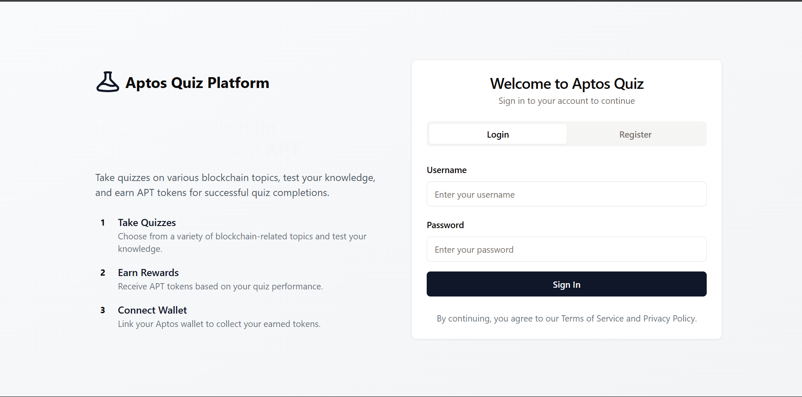

### Registeration Form
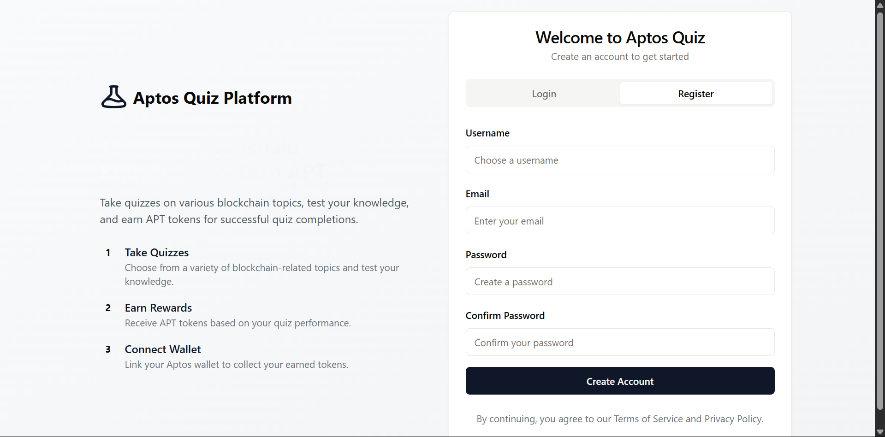

### User Dashboard
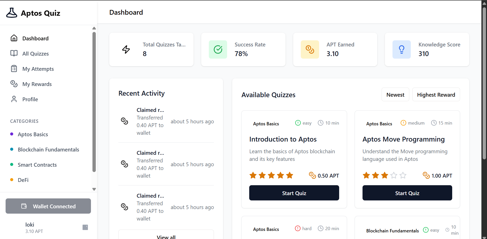

### Quize page with category filter 
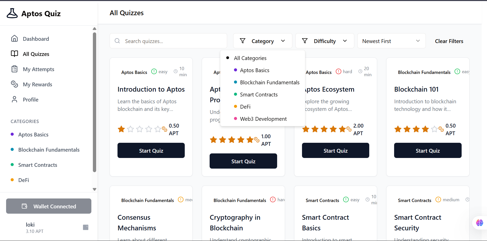

### Quize page with Difficulty filter
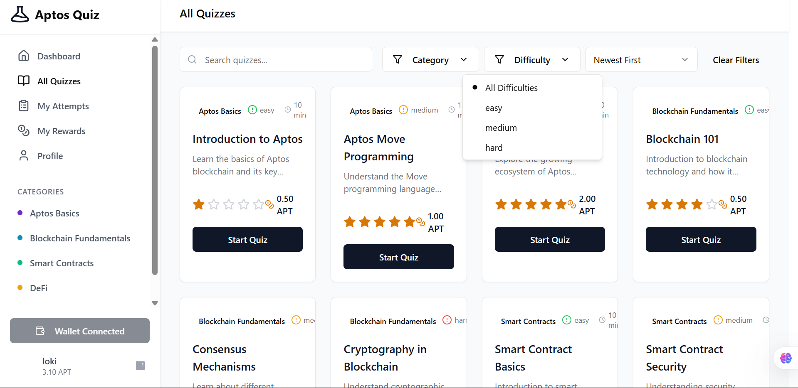

### Quize page with Other filters
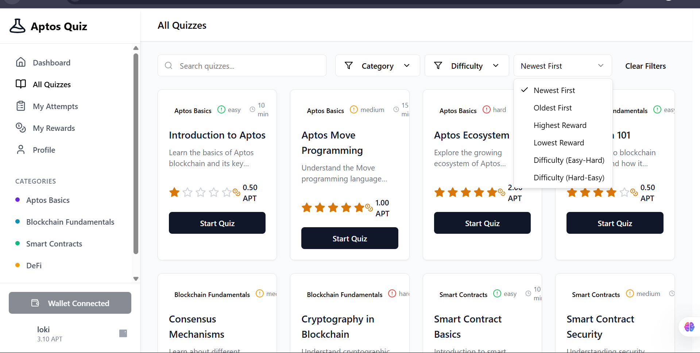

### Quiz Attempt page
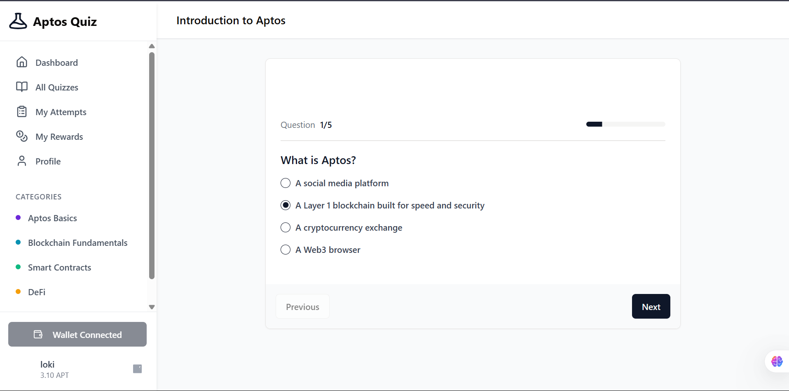

### Attempts or Quiz History
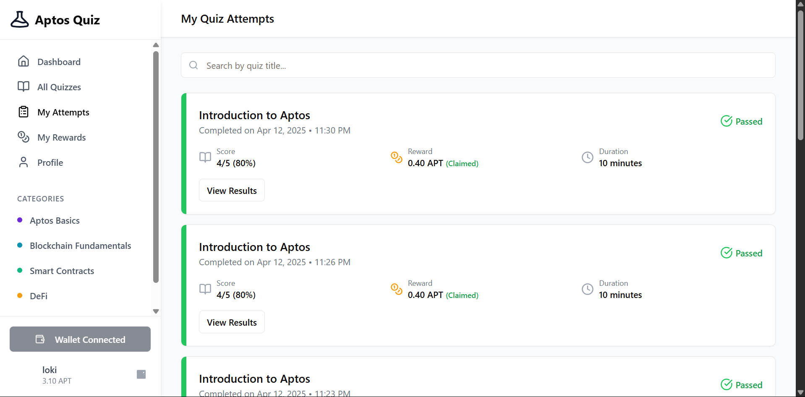

### Quiz reward claim page After succesfull Quiz completion
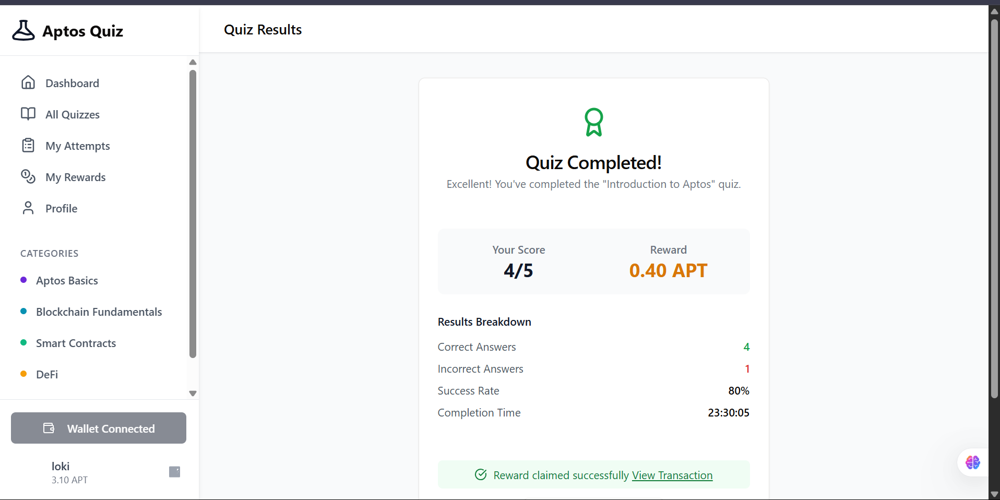

### Rewards and Trasaction history 
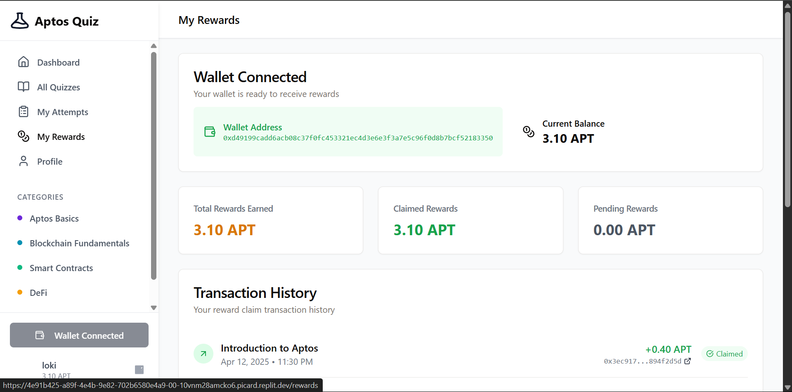

### Profile page
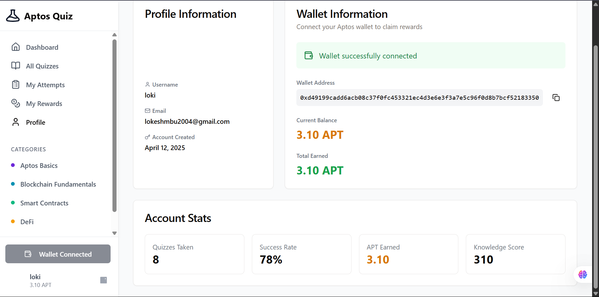

### Connecting to Petra Wallet
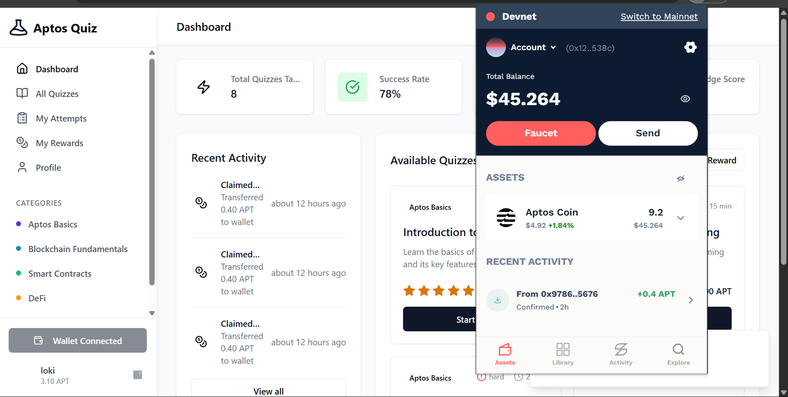

